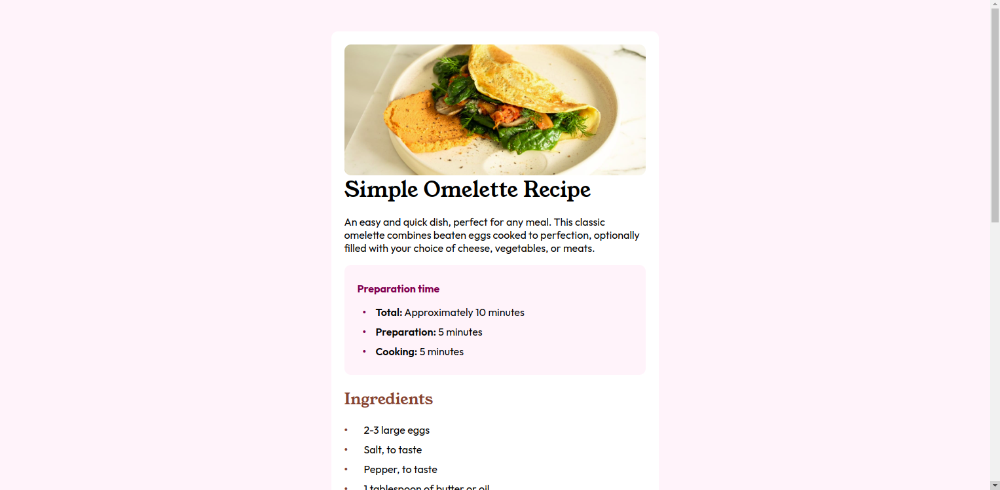

# Frontend Mentor - Recipe page

## Welcome! 👋

Recipe Page
Welcome to the Recipe Page project! This web page is designed to showcase a recipe with detailed information about preparation and cooking times, ingredients, and instructions.

Table of Contents
Demo
Features
Technologies
Setup
Usage
Contributing
License

Demo
Check out the live demo of the project: Recipe Page

Features
Displays recipe name, image, and description.
Lists preparation and cooking times.
Lists ingredients with quantities.
Step-by-step cooking instructions.
Responsive design for various screen sizes.

Technologies
This project is built using the following technologies:
HTML
CSS

Setup
To run this project locally, follow these steps:

Clone the repository:

sh
Copy code
git clone https://github.com/simopoza/recipe-page.git
Navigate to the project directory:

sh
Copy code
cd recipe-page
Open index.html in your web browser to view the page.

Usage
Open the index.html file in a web browser to view the recipe page.
Customize the HTML and CSS files to add your own recipes or change the design.
Contributing
Contributions are welcome! If you have any improvements or suggestions, feel free to submit a pull request or open an issue.

License
This project is open-source and available under the MIT License.
